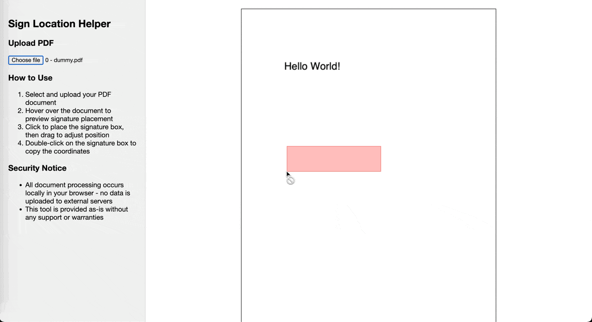

# Sign Location Helper
This is a fully client-side tool to assist in determining signature box coordinates in a PDF document for digital signing workflows (Sign with Singpass v3).

## 🧩 Features
- Visual preview of signature box placement
- Drag-to-adjust signature boxes with coordinate updates
- Copy normalized coordinates via double-click

## 🛡️ Security Notice
- All processing is done locally in your browser
- No data is sent or stored externally

## 📦 Dependencies
- CDN-hosted [PDF.js](https://cdnjs.com/libraries/pdf.js)
  - `pdf.min.js`
  - `pdf.worker.min.js`
  
